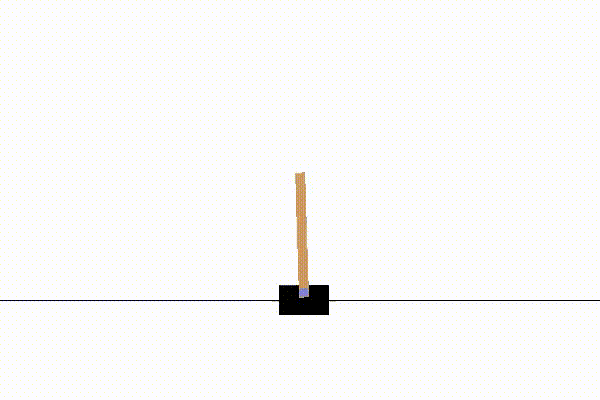

  

Monte-Carlo Tree Search for board games and for the deterministic OpenAI Gym environments.

The initial plans icluded experiments where MCTS is applied to the learned *world model* instead of the actual environment. The publication of *MuZero* algorithm made them obsolete.
